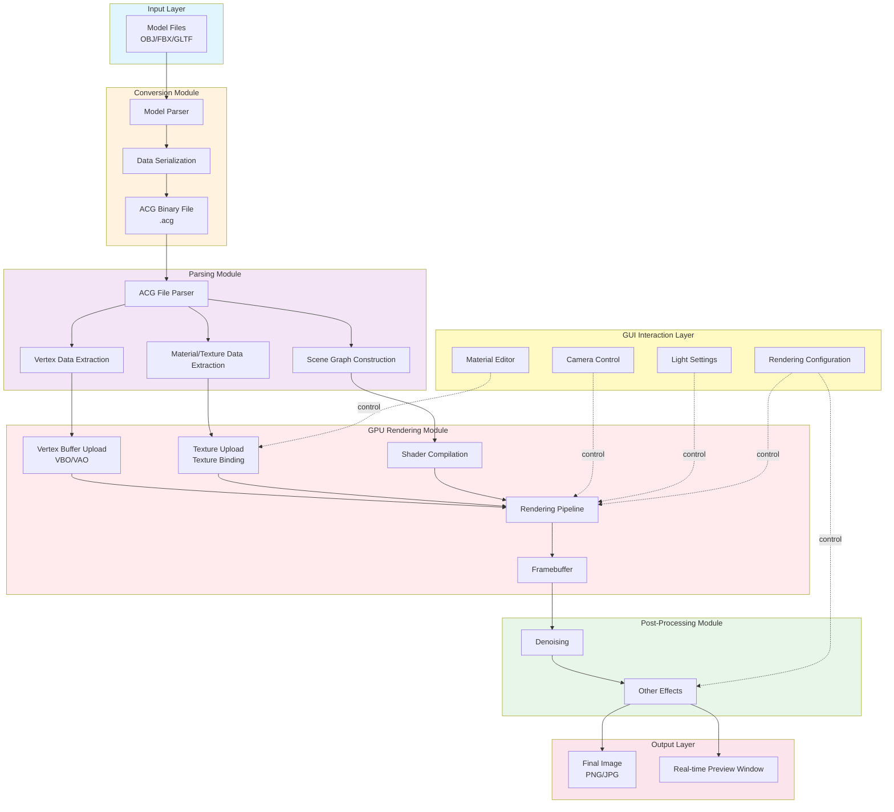

# ACG Midterm Report

This repository contains the midterm report and the slide for the ACG course.

```mermaid
graph TB
    subgraph Input["Input Layer"]
        A[Model Files<br/>OBJ/FBX/GLTF]
    end
    
    subgraph Converter["Conversion Module"]
        B[Model Parser]
        C[Data Serialization]
        D[ACG Binary File<br/>.acg]
    end
    
    subgraph Parser["Parsing Module"]
        E[ACG File Parser]
        F[Vertex Data Extraction]
        G[Material/Texture Data Extraction]
        H[Scene Graph Construction]
    end
    
    subgraph GPU["GPU Rendering Module"]
        I[Vertex Buffer Upload<br/>VBO/VAO]
        J[Texture Upload<br/>Texture Binding]
        K[Shader Compilation]
        L[Rendering Pipeline]
        M[Framebuffer]
    end
    
    subgraph PostProcess["Post-Processing Module"]
        N[Denoising]
        Q[Other Effects]
    end
    
    subgraph Output["Output Layer"]
        R[Final Image<br/>PNG/JPG]
        S[Real-time Preview Window]
    end
    
    subgraph GUI["GUI Interaction Layer"]
        U[Camera Control]
        V[Light Settings]
        W[Material Editor]
        X[Rendering Configuration]
    end
    
    %% Main Process
    A --> B
    B --> C
    C --> D
    D --> E
    E --> F
    E --> G
    E --> H
    F --> I
    G --> J
    H --> K
    I --> L
    J --> L
    K --> L
    L --> M
    M --> N
    N --> Q
    Q --> R
    Q --> S
    
    %% GUI Interaction Control
    U -.control.-> L
    V -.control.-> L
    W -.control.-> J
    X -.control.-> L
    X -.control.-> Q
    
    style Input fill:#e1f5ff
    style Converter fill:#fff3e0
    style Parser fill:#f3e5f5
    style GPU fill:#ffebee
    style PostProcess fill:#e8f5e9
    style Output fill:#fce4ec
    style GUI fill:#fff9c4
```